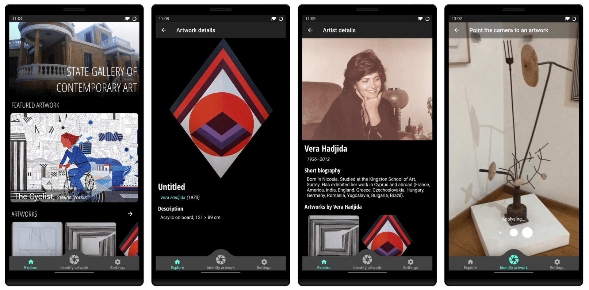

# Mobile app for the Cypriot National Gallery of Modern Art

The repository contains the source code for a cross-platform mobile app (built using Flutter) for
the [Cypriot National Gallery of Modern Art](https://www.nicosia.org.cy/en-GB/discover/picture-galleries/state-gallery-of-contemporary-art/)
in Nicosia, Cyprus.

The app was built by the [BIO-SCENT](https://bioscent.cyens.org.cy/) research group at 
[CYENS Centre of Excellence](https://www.cyens.org.cy), as part of the published study Theodosiou et al. (2022) [_"A Systematic Approach for 
Developing a Robust Artwork Recognition Framework Using Smartphone Cameras"_](https://doi.org/10.3390/a15090305).

The app is able to automatically identify a number of artworks at the Gallery through the use of
Computer Vision, and display details about them to the user. The artwork identification is performed live
on-device, using a Convolutional Neural Network (CNN) that trained using transfer learning on
MobileNet V2.

## Repository contents

The repository is split into 2 parts:

- The [source code](/smartphone_app) for the app demo, built using Flutter, and
- The [source code](/machine_learning_models) used to train and validate the neural networks, in Python.

## App demo

Pre-built `.apk` files for the app can be downloaded and run on any Android device from the Releases section on the sidebar.

## App screenshots

