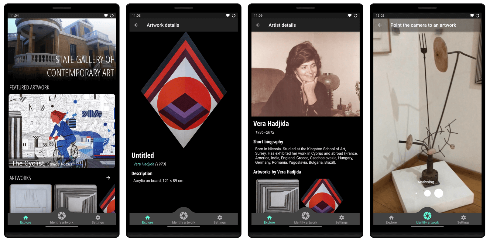

# Mobile app for the Cypriot National Gallery of Modern Art

The repository contains the source code for a cross-platform mobile app (built using Flutter) for
the [Cypriot National Gallery of Modern Art](https://www.nicosia.org.cy/en-GB/discover/picture-galleries/state-gallery-of-contemporary-art/)
in Nicosia, Cyprus.

The app was built by the [BIO-SCENT](https://bioscent.cyens.org.cy/) research group at
the [CYENS Centre of Excellence](https://www.cyens.org.cy), as part of the study _"A systematic
approach for developing a robust artwork recognition framework using smartphone cameras"_ (currently
under review).

The app is able to automatically identify a number of artworks at the Gallery through the use of
computer vision, and display details about them to the user. The artwork identification is performed
on-device, using a Convolutional Neural Network (CNN) that trained using transfer learning on
MobileNet V2.

